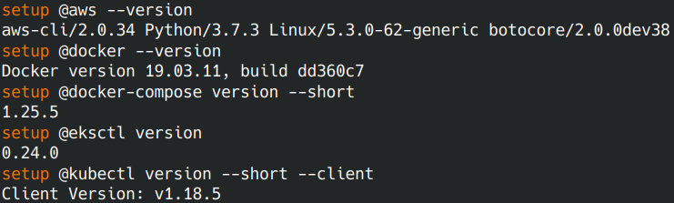
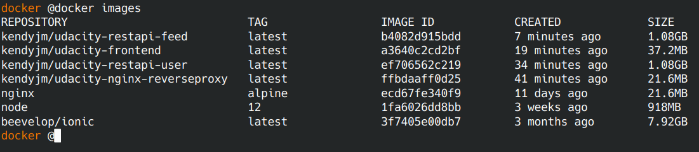
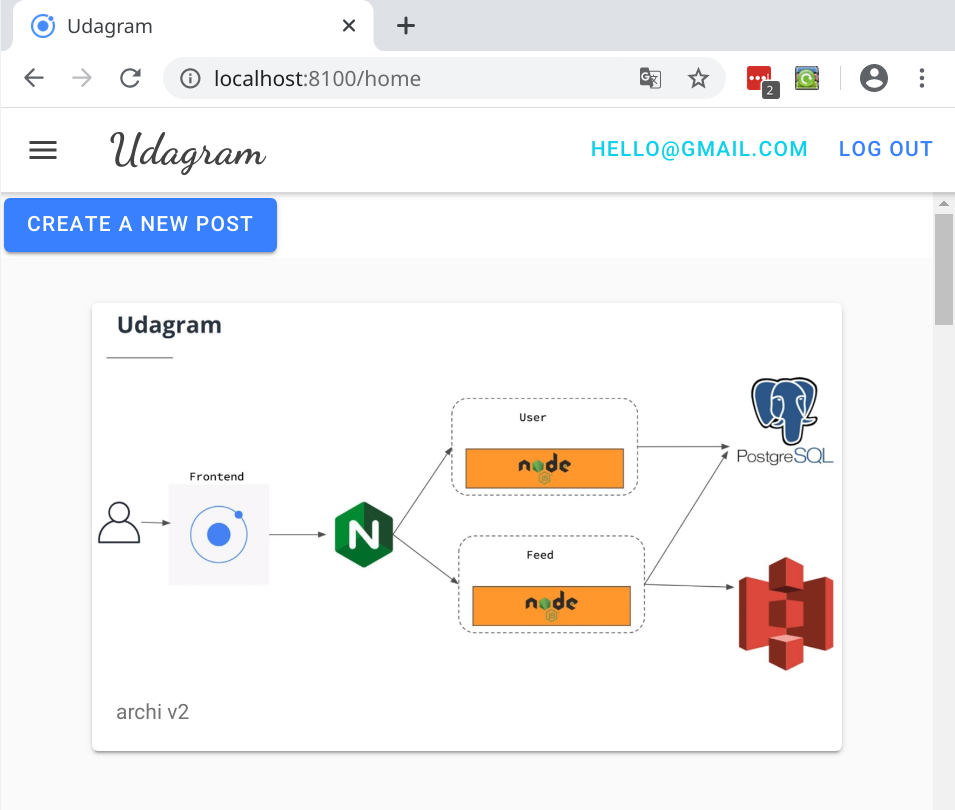
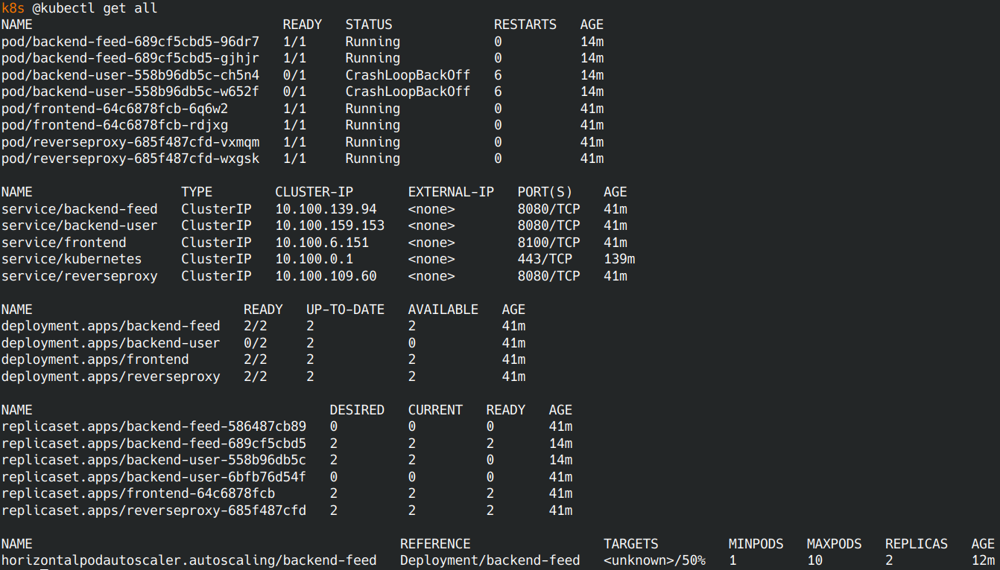
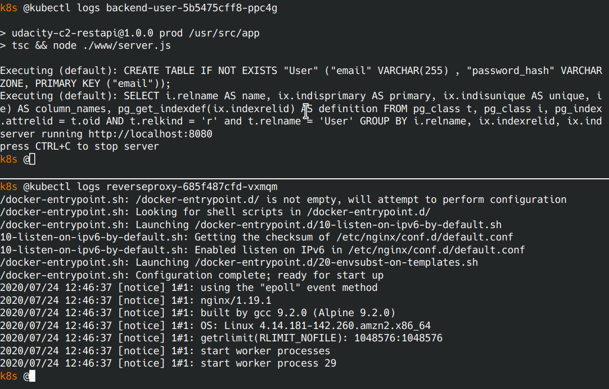
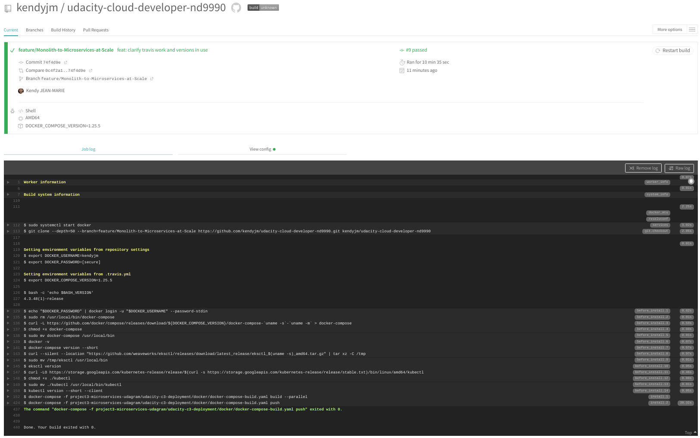

# Udagram Image Filtering Microservice

master: [](https://travis-ci.com/kendyjm/udacity-cloud-developer-nd9990) - development: [](https://travis-ci.com/kendyjm/udacity-cloud-developer-nd9990)

Udagram allows users to register and log into a web client, post photos to the feed, and process photos using an image filtering microservice.

The project is split into four parts:

1. [The Frontend](udacity-c2-frontend), an Ionic client web application which consumes the RestAPI feed and user.
2. [The RestAPI Feed Backend](udacity-c3-restapi-feed), a Node-Express feed microservice.
3. [The RestAPI User Backend](udacity-c3-restapi-user), a Node-Express user microservice.
4. [The reverse proxy server](udacity-c3-nginx-reverseproxy), a NGINX proxy server.

## Architecture


## Getting started

### Prerequisites

You need to install:

- [AWS CLI](https://docs.aws.amazon.com/cli/latest/userguide/install-cliv2-linux.html)
- [Docker](https://docs.docker.com/get-docker/)
- [Docker Compose](https://docs.docker.com/compose/install/)
- [Eksctl](https://docs.aws.amazon.com/eks/latest/userguide/getting-started-eksctl.html)  
- [Kubectl](https://docs.aws.amazon.com/eks/latest/userguide/install-kubectl.html)

### Installation

Test that your installation is successful with the following commands:

```bash
aws --version
docker --version
docker-compose version --short
eksctl version
kubectl version --short --client
```



### Setup Environment Variables

Open your bash profile to store your application variables at OS level to use them within and across applications:

```bash
open ~/.profile
```

Copy and Paste the bash scripts bellow with your values:

```bash
export DB_USERNAME=your postgress username;
export DB_PASSWORD=your postgress password;
export DB_NAME=your postgress database;
export DB_HOST=your postgress host;
export AWS_REGION=your aws region;
export AWS_PROFILE=your aws profile;
export AWS_MEDIA_BUCKET=your aws bucket name;
export JWT_SECRET=your jwt secret;
export ACCESS_CONTROL_ALLOW_ORIGIN=url of the frontend;
```

Source your .profile to execute your bash scripts automatically whenever a new interactive shell is started:

```bash
source ~/.profile
```  

### Running locally with Docker

#### 1) Pull or build images

To run the docker images, 2 options:

- 1a) Get Docker images from Docker Hub
- 1b) Build the Docker images

##### 1a) Get Docker images from Docker Hub

The project's images are available at Docker Hub :

- [kendyjm/udacity-restapi-feed](https://hub.docker.com/repository/docker/kendyjm/udacity-restapi-feed)
- [kendyjm/udacity-restapi-user](https://hub.docker.com/repository/docker/kendyjm/udacity-restapi-user)
- [kendyjm/udacity-frontend](https://hub.docker.com/repository/docker/kendyjm/udacity-frontend)
- [kendyjm/udacity-nginx-reverseproxy](https://hub.docker.com/repository/docker/kendyjm/udacity-nginx-reverseproxy)


Just push these images executing this script:

```bash
docker pull kendyjm/udacity-restapi-feed:latest
docker pull kendyjm/udacity-restapi-user:latest
docker pull kendyjm/udacity-nginx-reverseproxy:latest
docker pull kendyjm/udacity-frontend:latest
```

##### 1b) Build the Docker images

Build the docker images by following the documentation in [udacity-c3-deployment/docker](udacity-c3-deployment/docker)

#### 2) List your docker images

Check images available : `docker images`  



#### 3) Run

Run your docker containers: `docker-compose up`  

  

#### 4) Access Udagram

Browse the frontend application : <http://localhost:8100/>



To exit run `control + C`

### Run with a Kubernetes Cluster on Amazon EKS

Create your cluster with `eksctl` by following documentation in [udacity-c3-deployment/eks](udacity-c3-deployment/eks)

Your cluster is created and visible in the [AWS Console/EKS](https://eu-west-3.console.aws.amazon.com/eks/home#/clusters):


#### Setup Kubernetes Environment

Setup the ubernetes environment by following the documentation in [udacity-c3-deployment/k8s](udacity-c3-deployment/k8s)

#### Check status of all resources (services, delpoyments, pods, hpa)

```bash
kubectl get all
```



#### Check pods logs

```bash
kubectl logs <podId>
```



#### Connect the Services with Port Forwarding

Use Port Forwarding to the Frontend and Reverse Proxy services:
The port forwarding must be done in Separate terminals, to run both services at the same time.

```bash
kubectl port-forward service/frontend 8100:8100
kubectl port-forward service/reverseproxy 8080:8080
```

Browse the frontend application : <http://localhost:8100/>

### CI/CD with Travis

- Sign up for [Travis](https://travis-ci.com) and connect your Github application repository to TravisCL.
- Have a look to the [config file](../.travis.yml) that will be read by Travis, at the root of the repository. It needs some environment variables.
- Add your environment variables to the project repository in [Travis](https://travis-ci.com) by selecting the setting option.
- Commit and Push your changes trigger a Travis build.
- Check the build status page to see if your build passes or fails according to the return status of the build command by visiting [TravisCL](https://travis-ci.com) and selecting your repository.


