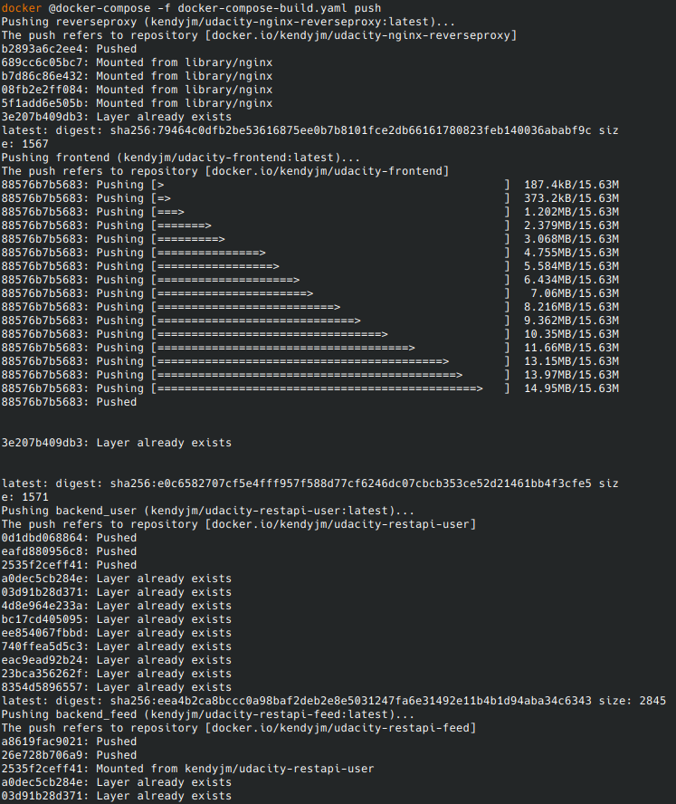

# Udagram Image Filtering Microservice

Udagram is a simple cloud application developed alongside the Udacity Cloud Engineering Nanodegree. It allows users to register and log into a web client, post photos to the feed, and process photos using an image filtering microservice.

The project is split into four parts:

1. [The Simple Frontend](udacity-c3-frontend)
A basic Ionic client web application which consumes the RestAPI Backend.
2. [The RestAPI Feed Backend](udacity-c3-restapi-feed), a Node-Express feed microservice.
3. [The RestAPI User Backend](udacity-c3-restapi-user), a Node-Express user microservice.
4. [The reverse proxy server](udaciy-c3-nginx-reverseproxy), a NGINX proxy server.

## Architecture


## Getting started

### Prerequisites

You need to install:

- [AWS CLI](https://docs.aws.amazon.com/cli/latest/userguide/install-linux.html)
- [Docker](https://docs.docker.com/get-docker/)
- [Docker Compose](https://docs.docker.com/compose/install/)
- [Eksctl](https://docs.aws.amazon.com/eks/latest/userguide/getting-started-eksctl.html)  
- [Kubectl](https://docs.aws.amazon.com/eks/latest/userguide/install-kubectl.html)

### Installation

Test that your installation was Successful with the following commands:

```bash
aws --version
docker --version
docker-compose version --short
eksctl version
kubectl version --short --client
```


### Setup Environment Variables

Open your bash profile to store your application variables at OS level to use them within and across applications:

```bash
open ~/.profile
```

Copy and Paste the bash scripts bellow with your values:

```bash
export DB_USERNAME=your postgress username;
export DB_PASSWORD=your postgress password;
export DB_NAME=your postgress database;
export DB_HOST=your postgress host;
export AWS_REGION=your aws region;
export AWS_PROFILE=your aws profile;
export AWS_MEDIA_BUCKET=your aws bucket name;
export JWT_SECRET=your jwt secret;
export ACCESS_CONTROL_ALLOW_ORIGIN=url of the frontend;
```

Source your .profile to execute your bash scripts automatically whenever a new interactive shell is started:

```bash
source ~/.profile
```  

### Running locally with Docker

#### 1) Push or build images

To run the docker images, 2 options:
1a) Get existing images from DOcker Hub
1b) Build your images

##### 1a) Get Docker hub images

The project's images are available at Docker Hub :

- [kendyjm/udacity-restapi-feed](https://hub.docker.com/repository/docker/kendyjm/udacity-restapi-feed)
- [kendyjm/udacity-restapi-user](https://hub.docker.com/repository/docker/kendyjm/udacity-restapi-user)
- [kendyjm/udacity-frontend](https://hub.docker.com/repository/docker/kendyjm/udacity-frontend)
- [kendyjm/udacity-nginx-reverseproxy](https://hub.docker.com/repository/docker/kendyjm/udacity-nginx-reverseproxy)

Just push these images executing this script:

```bash
docker pull kendyjm/udacity-restapi-feed:latest
docker pull kendyjm/udacity-restapi-user:latest
docker pull kendyjm/udacity-nginx-reverseproxy:latest
docker pull kendyjm/udacity-frontend:latest
```

##### 1b) Build the images

Build the docker images by following the documentation in [udacity-c3-deployment/docker](udacity-c3-deployment/docker)


#### 2) List your docker images

To check if they have been built: `docker images`  


#### 3) Run

Run your docker containers: `docker-compose up`  

  

#### Access Udagram

Test if everything is ok by browsing the frontend application running in localhost : <http://localhost:8100/>


To exit run `control + C`

#### Push

Push the images: `docker-compose -f docker-compose-build.yaml push`

  

Check your [Docker Hub](https://hub.docker.com/) to find the pushed images:


