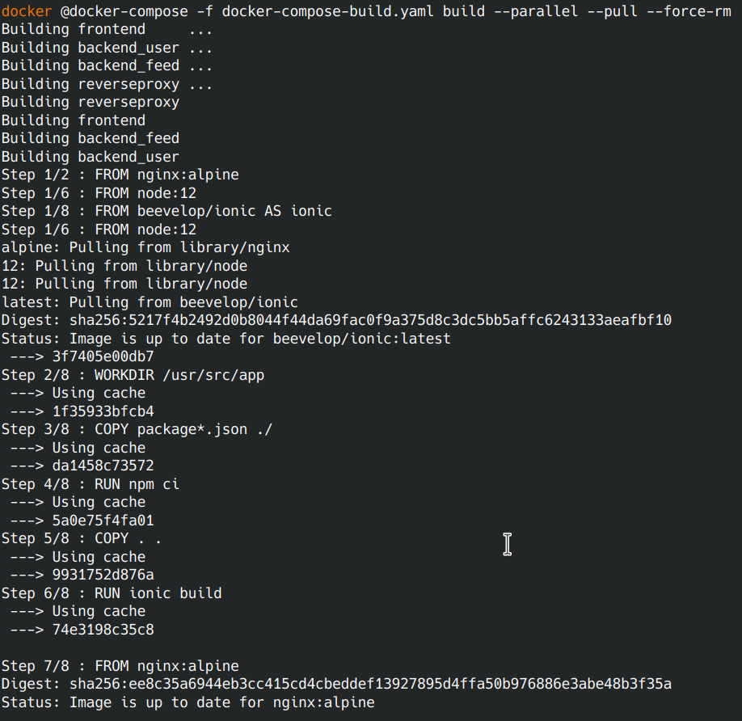

# Docker compose usage

Open a new terminal within the project directory and run:

1. Build the images: `docker-compose -f docker-compose-build.yaml build --parallel --pull --force-rm`

2. Check images available : `docker images`  

3. Push the images: `docker-compose -f docker-compose-build.yaml push`

4. Run the containers: `docker-compose up`

