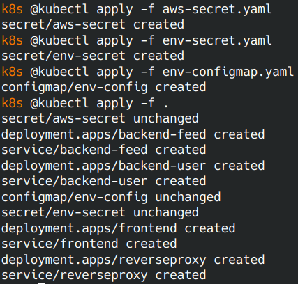

# Setup Kubernetes Environment

## Edit Kubernetes Configmaps and Secrets

Encrypt your database username and password using base64 and running this commands:

```bash
echo -n $DB_PASSWORD | base64
echo -n $DB_USERNAME | base64
```

Encrypt your aws file using base64 and running this command:

```bash
cat ~/.aws/credentials | base64
```  

Add these values in the coresponding empty fiels in `env-secret.yaml`, `aws-secret.yaml` and `env-configmap.yaml`.

## Load Kubernetes Environment

Load secret files:

```bash
kubectl apply -f aws-secret.yaml
kubectl apply -f env-secret.yaml
kubectl apply -f env-configmap.yaml
```

Apply all other yaml files:

```bash
kubectl apply -f .
```



## Enable Horizontal Scaling In Kubernetes

This optional, enable [Horizontal Pod Autoscaler](https://kubernetes.io/docs/tasks/run-application/horizontal-pod-autoscale/) on deployments.

## Check status of all resources (services, delpoyments, pods, hpa)

```bash
kubectl get all
```


## Check pods logs

```bash
kubectl logs <podId>
```


